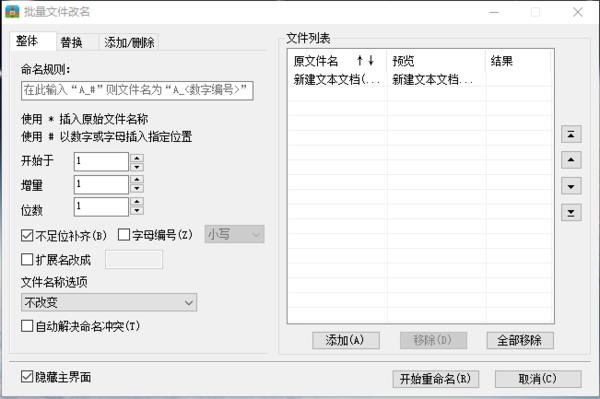
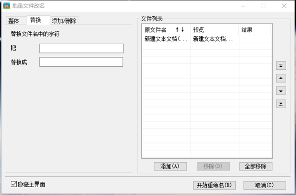
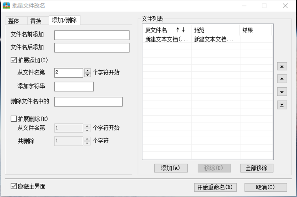

# 功能说明: 重命名

基本想实现一个命令行版的**2345好压批量修改文件名**软件的复刻版, 因为以前用这个软件非常好用

但是因为这个小软件是嵌入在 2345好压 整体软件中的, 也会带一些广告, 很烦, 就想自己实现一个命令行版, 便以自己使用

## 2345好压批量修改文件名程序的工作内容

摘录自:
* [2345好压怎么批量修改文件名？2345好压批量修改文件名的教程](https://mydown.yesky.com/news/87287477.html)
* [2345好压能修改文件名吗_2345好压文件改名攻略](https://mydown.yesky.com/news/725817872.html)

**2345好压实用工具批量文件改名说明：**

### 整体

命名规则：定义重命名过程中的命名规则，可使用 `*` 与 `#` 号。

> `*` 号代表原文件名。
> `#` 号代表以数字或字母插入置顶位置。

例：
> 原文件名为 `haozip.zip`
> 命名规则输入 `haozip_*`
> 则命名结果为：`haozip_haozip.zip`
> 命名规则输入 `haozip_#` (#定义开始为1)
> 则命名结果为：`haozip_01.zip`

**不足位补齐**：勾选此项，如出现#号序列位数小于定义位数的情况，则对不足位进行补齐，数字序列补0，字母序列补a。您可以在预览区域看到重命名结果。

**字母编号**：勾选此项，`#` 号序列定义为字母序列重命名。您可以在预览区域看到重命名结果。注：`*` 号与 `#` 号可同时并反复出现在命名规则中，如果批量命名规则中没有出现任何 `#` 号序列，那么所有文件将被定义为同一文件名。您可以在预览区域看到重命名结果。

**扩展名改成**：此处可以修改文件扩展名，如不填写则不修改。填写“<空格>”则删除现有文件扩展名。

**文件名称选项**：此处提供的选项可以自定义重命名结果中的文件名及扩展名的大小写。默认保持不变。您可以在预览区域看到重命名结果。

##### 自动解决重命名冲突

如果重命名过程中出现命名冲突，2345好压将会按照windows默认规则处理重命名冲突。(冲突文件名称后加: ` - 副本`)

### 替换

提供了文件名的批量替换，您可以搜索文件名中的某个字符，并加以替换。您可以在预览区域看到重命名结果。

### 添加/删除

**文件名前添加**：不改变原有文件名与命名规则，统一在文件列表中的所有文件名前增加字符。您可以在预览区域看到重命名结果。

**文件名后添加**：不改变原有文件名与命名规则，统一在文件列表中的所有文件名后增加字符。您可以在预览区域看到重命名结果。

**扩展添加**：勾选后启用扩展添加功能。可自定义从文件名的某个字符后统一增加的字符。您可以在预览区域看到重命名结果。

**删除文件名中的**：此功能可统一删除文件名种的某个字符。您可以在预览区域看到重命名结果。

**扩展删除**：勾选后启用扩展删除功能。可自定义从文件名某个字符后统一删除若干字符。您可以在预览区域看到重命名结果。
